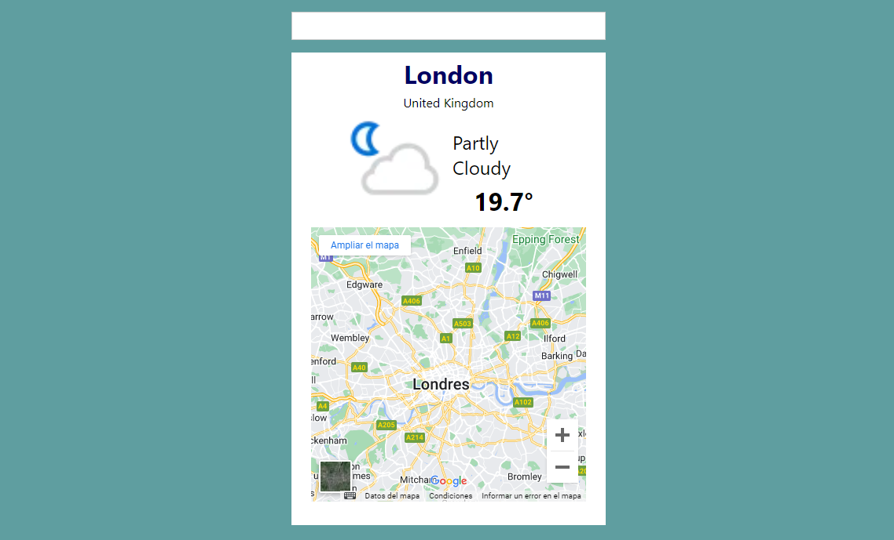

# Página Web del Clima

Este proyecto es una aplicación web construida con React que muestra la información del clima para diferentes ciudades. La aplicación consume una API pública del clima para obtener datos meteorológicos y utiliza un componente de Google Maps para mostrar la ubicación de las ciudades. Los usuarios pueden buscar ciudades para obtener la previsión del clima actual y ver la ubicación en un mapa interactivo.

## Captura de Pantalla



## Características

- **Buscar ciudades:** Permite a los usuarios buscar el clima en diferentes ciudades.
- **Información del clima:** Muestra la temperatura, condiciones meteorológicas, humedad y más.
- **Mapa interactivo:** Utiliza un componente de Google Maps para mostrar la ubicación de la ciudad buscada.

## Instalación

1. **Clonar el repositorio:**

   ```bash
   git clone https://github.com/tu-usuario/nombre-del-repositorio.git

## Tecnologías Utilizadas

- **React:** Biblioteca principal para la construcción de la interfaz de usuario.
- **React Router:** Para la navegación en la aplicación.
- **Axios:** Para realizar solicitudes HTTP a la API del clima.
- **Google Maps JavaScript API:** Para integrar mapas interactivos.
